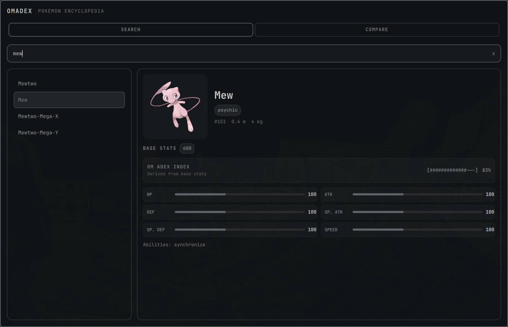
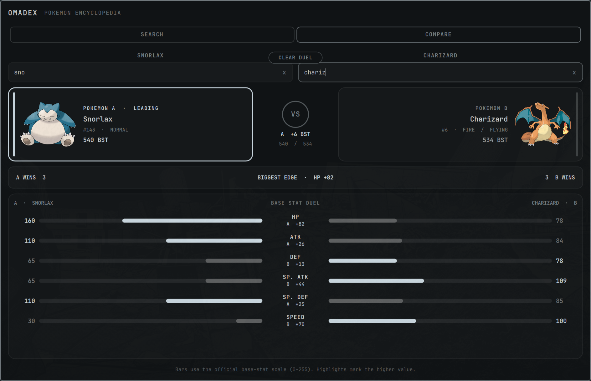

# Omadex

Omadex is a searchable Pokemon encyclopedia and base-stat comparison panel for
Omarchy Quattro.

It uses [PokeAPI](https://pokeapi.co/) for Pokemon names, artwork, types,
abilities, and base stats. It does not require an API key.



## Features

- Fast local-name search with keyboard navigation
- Artwork, typing, abilities, measurements, and base stats
- Two-Pokemon comparison with mirrored stat bars and transparent differences
- Theme-aware centered window
- Mouse and keyboard operation

## Compare Pokemon

Select two Pokemon to see their base-stat totals, category wins, largest stat
advantage, and a mirrored breakdown on the official 0-255 base-stat scale.



## Install

```bash
omarchy plugin add https://github.com/jacklapinza/omadex.git --enable
```

Summon it with:

```bash
omarchy-shell shell summon io.github.jacklapinza.omadex '{}'
```

Press Escape to close it.

Click the Poké Ball icon in the bar to open or close Omadex. Move it later with:

```bash
omarchy bar move io.github.jacklapinza.omadex --section left
```

## Remove

```bash
omarchy plugin remove io.github.jacklapinza.omadex
```

## Development notes

- The plugin runs inside the long-lived `omarchy-shell` process.
- PokeAPI asks clients to cache resources and avoid abusive traffic.
- Detail responses are cached in memory for the current shell session.
- Comparison results use PokéAPI base stats and do not claim to be competitive
  rankings or an official power score.

## Dependencies and network access

Omadex requires Omarchy Quattro and its standard Quickshell environment. The
centered window setup uses Omarchy's existing `hyprctl` and `jq` commands; it
does not install packages, require elevated privileges, or modify user
configuration. Pokémon names and details are fetched from PokéAPI over HTTPS,
without an API key. Artwork URLs are supplied by PokéAPI and loaded remotely.

## Attribution

Pokémon names and character names are trademarks of Nintendo. Omadex is not
affiliated with or endorsed by Nintendo, The Pokémon Company, or Game Freak.
Review the licenses and provenance of any sprites before bundling or
redistributing them.
